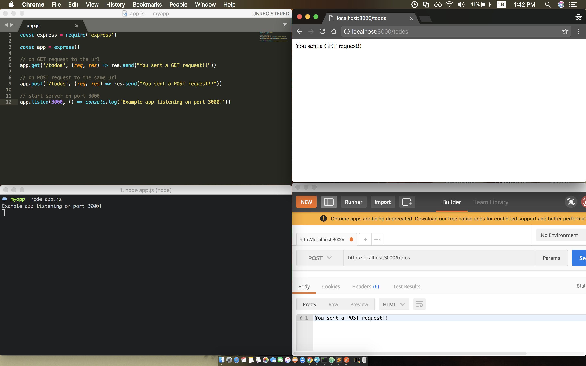

#### 1. NodeJS

###### JS REPL - `Read–Eval–Print Loop`

```sh
➜  ~ node
> 5 + 6
11
> var me = 'kan1shka9'
undefined
> me
'kan1shka9'
> document.querySelector()
ReferenceError: document is not defined
> console
Console {
  log: [Function: bound consoleCall],
  info: [Function: bound consoleCall],
  warn: [Function: bound consoleCall],
  error: [Function: bound consoleCall],
  dir: [Function: bound consoleCall],
  time: [Function: bound consoleCall],
  timeEnd: [Function: bound consoleCall],
  trace: [Function: bound consoleCall],
  assert: [Function: bound consoleCall],
  clear: [Function: bound consoleCall],
  count: [Function: bound consoleCall],
  countReset: [Function: bound countReset],
  group: [Function: bound consoleCall],
  groupCollapsed: [Function: bound consoleCall],
  groupEnd: [Function: bound consoleCall],
  Console: [Function: Console],
  debug: [Function: debug],
  dirxml: [Function: dirxml],
  table: [Function: table],
  markTimeline: [Function: markTimeline],
  profile: [Function: profile],
  profileEnd: [Function: profileEnd],
  timeline: [Function: timeline],
  timelineEnd: [Function: timelineEnd],
  timeStamp: [Function: timeStamp],
  context: [Function: context],
  [Symbol(counts)]: Map {} }
>
➜  ~
```

###### Exposing node modules so that they can be accessed

- Using the `exports` object on module we can expose our code to be `required` later

	- `config.js`

		```javascript
		exports.setup = function() {};
		exports.enable = function() {};
		exports.ready = true;
		```

		```sh
		node config.js
		```

	- `otherfile.js`

		```javascript
		module.exports = {
		  action: function(){},
		  trigger: true
		}
		```
		
		```sh
		node otherfile.js
		```
		
###### Executing `nodejs`

- `test .js`

	```javascript
	console.log("Hi There!!")
	console.log(4+7)
	```

	```sh
	☁  nodejs  node test
	Hi There!!
	11
	☁  nodejs
	```
	
- `module-http.js`

	```javascript
	var http = require('http')
	
	console.log(http)
	```
	
	```sh
	☁  nodejs  node module-http
	{ _connectionListener: [Function: connectionListener],
	  METHODS:
	   [ 'ACL',
	     'BIND',
	     'CHECKOUT',
	     'CONNECT',
	     'COPY',
	     'DELETE',
	     'GET',
	     'HEAD',
	     'LINK',
	     'LOCK',
	     'M-SEARCH',
	     'MERGE',
	     'MKACTIVITY',
	     'MKCALENDAR',
	     'MKCOL',
	     'MOVE',
	     'NOTIFY',
	     'OPTIONS',
	     'PATCH',
	     'POST',
	     'PROPFIND',
	     'PROPPATCH',
	     'PURGE',
	     'PUT',
	     'REBIND',
	     'REPORT',
	     'SEARCH',
	     'SUBSCRIBE',
	     'TRACE',
	     'UNBIND',
	     'UNLINK',
	     'UNLOCK',
	     'UNSUBSCRIBE' ],
	  STATUS_CODES:
	   { '100': 'Continue',
	     '101': 'Switching Protocols',
	     '102': 'Processing',
	     '200': 'OK',
	     '201': 'Created',
	     '202': 'Accepted',
	     '203': 'Non-Authoritative Information',
	     '204': 'No Content',
	     '205': 'Reset Content',
	     '206': 'Partial Content',
	     '207': 'Multi-Status',
	     '208': 'Already Reported',
	     '226': 'IM Used',
	     '300': 'Multiple Choices',
	     '301': 'Moved Permanently',
	     '302': 'Found',
	     '303': 'See Other',
	     '304': 'Not Modified',
	     '305': 'Use Proxy',
	     '307': 'Temporary Redirect',
	     '308': 'Permanent Redirect',
	     '400': 'Bad Request',
	     '401': 'Unauthorized',
	     '402': 'Payment Required',
	     '403': 'Forbidden',
	     '404': 'Not Found',
	     '405': 'Method Not Allowed',
	     '406': 'Not Acceptable',
	     '407': 'Proxy Authentication Required',
	     '408': 'Request Timeout',
	     '409': 'Conflict',
	     '410': 'Gone',
	     '411': 'Length Required',
	     '412': 'Precondition Failed',
	     '413': 'Payload Too Large',
	     '414': 'URI Too Long',
	     '415': 'Unsupported Media Type',
	     '416': 'Range Not Satisfiable',
	     '417': 'Expectation Failed',
	     '418': 'I\'m a teapot',
	     '421': 'Misdirected Request',
	     '422': 'Unprocessable Entity',
	     '423': 'Locked',
	     '424': 'Failed Dependency',
	     '425': 'Unordered Collection',
	     '426': 'Upgrade Required',
	     '428': 'Precondition Required',
	     '429': 'Too Many Requests',
	     '431': 'Request Header Fields Too Large',
	     '451': 'Unavailable For Legal Reasons',
	     '500': 'Internal Server Error',
	     '501': 'Not Implemented',
	     '502': 'Bad Gateway',
	     '503': 'Service Unavailable',
	     '504': 'Gateway Timeout',
	     '505': 'HTTP Version Not Supported',
	     '506': 'Variant Also Negotiates',
	     '507': 'Insufficient Storage',
	     '508': 'Loop Detected',
	     '509': 'Bandwidth Limit Exceeded',
	     '510': 'Not Extended',
	     '511': 'Network Authentication Required' },
	  Agent:
	   { [Function: Agent]
	     super_:
	      { [Function: EventEmitter]
	        EventEmitter: [Circular],
	        usingDomains: false,
	        defaultMaxListeners: [Getter/Setter],
	        init: [Function],
	        listenerCount: [Function] },
	     defaultMaxSockets: Infinity },
	  ClientRequest: { [Function: ClientRequest] super_: { [Function: OutgoingMessage] super_: [Object] } },
	  globalAgent:
	   Agent {
	     domain: null,
	     _events: { free: [Function] },
	     _eventsCount: 1,
	     _maxListeners: undefined,
	     defaultPort: 80,
	     protocol: 'http:',
	     options: { path: null },
	     requests: {},
	     sockets: {},
	     freeSockets: {},
	     keepAliveMsecs: 1000,
	     keepAlive: false,
	     maxSockets: Infinity,
	     maxFreeSockets: 256 },
	  IncomingMessage:
	   { [Function: IncomingMessage]
	     super_:
	      { [Function: Readable]
	        ReadableState: [Function: ReadableState],
	        super_: [Object],
	        _fromList: [Function: fromList] } },
	  OutgoingMessage:
	   { [Function: OutgoingMessage]
	     super_:
	      { [Function: Stream]
	        super_: [Object],
	        Readable: [Object],
	        Writable: [Object],
	        Duplex: [Object],
	        Transform: [Object],
	        PassThrough: [Object],
	        Stream: [Circular],
	        _isUint8Array: [Function: isUint8Array],
	        _uint8ArrayToBuffer: [Function: _uint8ArrayToBuffer] } },
	  Server: { [Function: Server] super_: { [Function: Server] super_: [Object] } },
	  ServerResponse: { [Function: ServerResponse] super_: { [Function: OutgoingMessage] super_: [Object] } },
	  createServer: [Function: createServer],
	  get: [Function: get],
	  request: [Function: request] }
	☁  nodejs
	```
	
###### Nodejs Frameworks

- [Watch out for nodejs frameworks](http://nodeframework.com/)
- [13 Node.js Frameworks to Build Web APIs](https://nordicapis.com/13-node-js-frameworks-to-build-web-apis/)

###### Express

- [Evented IO](http://ksat.me/what-is-evented-io-and-why-it-scales/)

```sh
☁  Desktop  mkdir myapp
☁  Desktop  cd myapp
☁  myapp  npm init
This utility will walk you through creating a package.json file.
It only covers the most common items, and tries to guess sensible defaults.

See `npm help json` for definitive documentation on these fields
and exactly what they do.

Use `npm install <pkg>` afterwards to install a package and
save it as a dependency in the package.json file.

Press ^C at any time to quit.
package name: (myapp)
version: (1.0.0)
description:
entry point: (index.js) app.js
test command:
git repository:
keywords:
license: (MIT)
About to write to /Users/kanishka/Desktop/myapp/package.json:

{
  "name": "myapp",
  "version": "1.0.0",
  "description": "",
  "main": "app.js",
  "scripts": {
    "test": "echo \"Error: no test specified\" && exit 1"
  },
  "author": "kanishka <kanishka.s9@gmail.com> (https://kan1shka9.github.io/)",
  "license": "MIT"
}


Is this ok? (yes)
☁  myapp  ll
total 8
-rw-r--r--  1 kanishka  staff   262B Mar 18 12:52 package.json
☁  myapp  npm install express --save
npm notice created a lockfile as package-lock.json. You should commit this file.
npm WARN myapp@1.0.0 No description
npm WARN myapp@1.0.0 No repository field.

+ express@4.16.3
added 49 packages from 47 contributors in 2.693s
☁  myapp  ll
total 40
drwxr-xr-x  50 kanishka  staff   1.6K Mar 18 12:52 node_modules
-rw-r--r--   1 kanishka  staff    13K Mar 18 12:52 package-lock.json
-rw-r--r--   1 kanishka  staff   311B Mar 18 12:52 package.json
☁  myapp
```

`app.js`

```javascript
const express = require('express')

const app = express()

// on GET request to the url
app.get('/todos', (req, res) => res.send("You sent a GET request!!"))

// on POST request to the same url
app.post('/todos', (req, res) => res.send("You sent a POST request!!"))

// start server on port 3000
app.listen(3000, () => console.log('Example app listening on port 3000!'))
```

