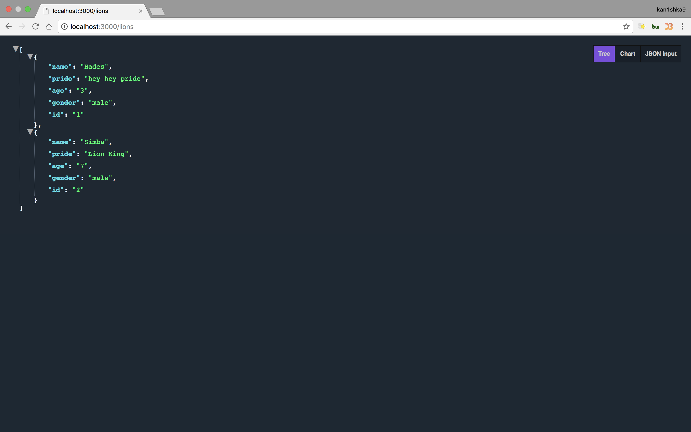

#### 2. REST API

```sh
☁  Desktop  mkdir rest-api
☁  Desktop  cd rest-api
☁  rest-api  npm init
This utility will walk you through creating a package.json file.
It only covers the most common items, and tries to guess sensible defaults.

See `npm help json` for definitive documentation on these fields
and exactly what they do.

Use `npm install <pkg>` afterwards to install a package and
save it as a dependency in the package.json file.

Press ^C at any time to quit.
package name: (rest-api)
version: (1.0.0)
description:
entry point: (index.js) server.js
test command:
git repository:
keywords:
license: (MIT)
About to write to /Users/kanishka/Desktop/rest-api/package.json:

{
  "name": "rest-api",
  "version": "1.0.0",
  "description": "",
  "main": "server.js",
  "scripts": {
    "test": "echo \"Error: no test specified\" && exit 1"
  },
  "author": "kanishka <kanishka.s9@gmail.com> (https://kan1shka9.github.io/)",
  "license": "MIT"
}


Is this ok? (yes)
☁  rest-api  npm install express --save
npm notice created a lockfile as package-lock.json. You should commit this file.
npm WARN rest-api@1.0.0 No description
npm WARN rest-api@1.0.0 No repository field.

+ express@4.16.3
added 49 packages from 47 contributors in 2.919s
☁  rest-api  npm install bodyParser --save
npm ERR! code E404
npm ERR! 404 Not Found: bodyParser@latest

npm ERR! A complete log of this run can be found in:
npm ERR!     /Users/kanishka/.npm/_logs/2018-03-19T00_01_36_836Z-debug.log
☁  rest-api  npm install lodash --save
npm WARN rest-api@1.0.0 No description
npm WARN rest-api@1.0.0 No repository field.

+ lodash@4.17.5
added 1 package from 2 contributors in 1.82s
☁  rest-api  ll
total 40
drwxr-xr-x  50 kanishka  staff   1.6K Mar 18 17:01 node_modules
-rw-r--r--   1 kanishka  staff    13K Mar 18 17:01 package-lock.json
-rw-r--r--   1 kanishka  staff   317B Mar 18 17:01 package.json
☁  rest-api
```

```sh
☁  rest-api  nodemon server/server.js
[nodemon] 1.17.2
[nodemon] to restart at any time, enter `rs`
[nodemon] watching: *.*
[nodemon] starting `node server/server.js`
on port 3000
```




