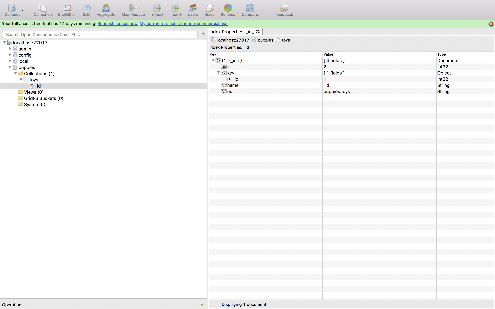
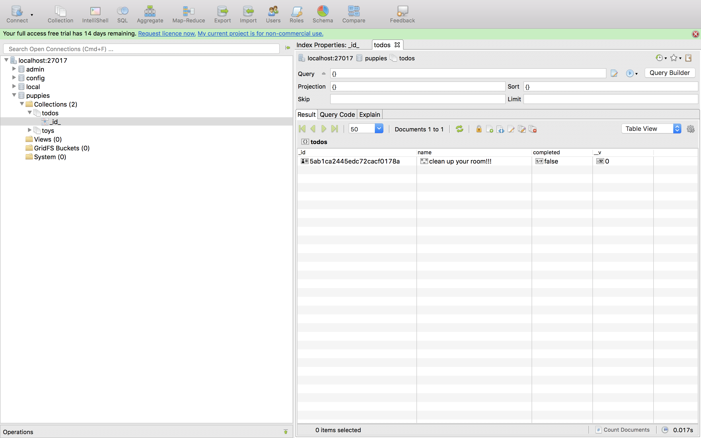

#### 8. Mongo

- [`MongoDB Download Center`](https://www.mongodb.com/download-center#community)

```sh
☁  ~  cd Downloads
☁  Downloads  tar xvzf mongodb-osx-ssl-x86_64-3.6.3.tgz
x mongodb-osx-x86_64-3.6.3/README
x mongodb-osx-x86_64-3.6.3/THIRD-PARTY-NOTICES
x mongodb-osx-x86_64-3.6.3/MPL-2
x mongodb-osx-x86_64-3.6.3/GNU-AGPL-3.0
x mongodb-osx-x86_64-3.6.3/bin/mongodump
x mongodb-osx-x86_64-3.6.3/bin/mongorestore
x mongodb-osx-x86_64-3.6.3/bin/mongoexport
x mongodb-osx-x86_64-3.6.3/bin/mongoimport
x mongodb-osx-x86_64-3.6.3/bin/mongostat
x mongodb-osx-x86_64-3.6.3/bin/mongotop
x mongodb-osx-x86_64-3.6.3/bin/bsondump
x mongodb-osx-x86_64-3.6.3/bin/mongofiles
x mongodb-osx-x86_64-3.6.3/bin/mongoreplay
x mongodb-osx-x86_64-3.6.3/bin/mongoperf
x mongodb-osx-x86_64-3.6.3/bin/mongod
x mongodb-osx-x86_64-3.6.3/bin/mongos
x mongodb-osx-x86_64-3.6.3/bin/mongo
x mongodb-osx-x86_64-3.6.3/bin/install_compass
☁  Downloads  cd mongodb-osx-x86_64-3.6.3
☁  mongodb-osx-x86_64-3.6.3  ll
total 232
-rw-r--r--@  1 kanishka  staff    34K Feb 22 11:37 GNU-AGPL-3.0
-rw-r--r--@  1 kanishka  staff    16K Feb 22 11:37 MPL-2
-rw-r--r--@  1 kanishka  staff   2.1K Feb 22 11:37 README
-rw-r--r--@  1 kanishka  staff    56K Feb 22 11:37 THIRD-PARTY-NOTICES
drwxr-xr-x  16 kanishka  staff   512B Mar 20 11:53 bin
☁  mongodb-osx-x86_64-3.6.3  cd bin
☁  bin  ll
total 561776
-rwxr-xr-x@ 1 kanishka  staff    10M Feb 22 11:37 bsondump
-rwxr-xr-x@ 1 kanishka  staff   5.7K Feb 22 12:03 install_compass
-rwxr-xr-x@ 1 kanishka  staff    31M Feb 22 12:01 mongo
-rwxr-xr-x@ 1 kanishka  staff    55M Feb 22 12:00 mongod
-rwxr-xr-x@ 1 kanishka  staff    13M Feb 22 11:38 mongodump
-rwxr-xr-x@ 1 kanishka  staff    11M Feb 22 11:38 mongoexport
-rwxr-xr-x@ 1 kanishka  staff    11M Feb 22 11:38 mongofiles
-rwxr-xr-x@ 1 kanishka  staff    11M Feb 22 11:38 mongoimport
-rwxr-xr-x@ 1 kanishka  staff    54M Feb 22 12:00 mongoperf
-rwxr-xr-x@ 1 kanishka  staff    14M Feb 22 11:39 mongoreplay
-rwxr-xr-x@ 1 kanishka  staff    14M Feb 22 11:38 mongorestore
-rwxr-xr-x@ 1 kanishka  staff    30M Feb 22 11:50 mongos
-rwxr-xr-x@ 1 kanishka  staff    11M Feb 22 11:38 mongostat
-rwxr-xr-x@ 1 kanishka  staff    11M Feb 22 11:39 mongotop
☁  bin  sudo bash
Password:
bash-3.2# mkdir -p /data/db
bash-3.2# chmod 777 /data/db/
bash-3.2# ls -ld /data/db/
drwxrwxrwx  2 root  wheel  64 Mar 20 11:55 /data/db/
bash-3.2# exit
exit
☁  bin  whoami
kanishka
☁  bin 
```

```sh
☁  bin  ./mongod
2018-03-20T11:55:53.630-0700 I CONTROL  [initandlisten] MongoDB starting : pid=9324 port=27017 dbpath=/data/db 64-bit host=Kanishkas-MacBook-Pro.local
2018-03-20T11:55:53.630-0700 I CONTROL  [initandlisten] db version v3.6.3
2018-03-20T11:55:53.630-0700 I CONTROL  [initandlisten] git version: 9586e557d54ef70f9ca4b43c26892cd55257e1a5
2018-03-20T11:55:53.631-0700 I CONTROL  [initandlisten] OpenSSL version: OpenSSL 0.9.8zh 14 Jan 2016
2018-03-20T11:55:53.631-0700 I CONTROL  [initandlisten] allocator: system
2018-03-20T11:55:53.631-0700 I CONTROL  [initandlisten] modules: none
2018-03-20T11:55:53.631-0700 I CONTROL  [initandlisten] build environment:
2018-03-20T11:55:53.631-0700 I CONTROL  [initandlisten]     distarch: x86_64
2018-03-20T11:55:53.631-0700 I CONTROL  [initandlisten]     target_arch: x86_64
2018-03-20T11:55:53.631-0700 I CONTROL  [initandlisten] options: {}
2018-03-20T11:55:53.631-0700 I STORAGE  [initandlisten] wiredtiger_open config: create,cache_size=3584M,session_max=20000,eviction=(threads_min=4,threads_max=4),config_base=false,statistics=(fast),log=(enabled=true,archive=true,path=journal,compressor=snappy),file_manager=(close_idle_time=100000),statistics_log=(wait=0),verbose=(recovery_progress),
2018-03-20T11:55:54.328-0700 I CONTROL  [initandlisten]
2018-03-20T11:55:54.328-0700 I CONTROL  [initandlisten] ** WARNING: Access control is not enabled for the database.
2018-03-20T11:55:54.328-0700 I CONTROL  [initandlisten] **          Read and write access to data and configuration is unrestricted.
2018-03-20T11:55:54.328-0700 I CONTROL  [initandlisten]
2018-03-20T11:55:54.328-0700 I CONTROL  [initandlisten] ** WARNING: This server is bound to localhost.
2018-03-20T11:55:54.328-0700 I CONTROL  [initandlisten] **          Remote systems will be unable to connect to this server.
2018-03-20T11:55:54.328-0700 I CONTROL  [initandlisten] **          Start the server with --bind_ip <address> to specify which IP
2018-03-20T11:55:54.328-0700 I CONTROL  [initandlisten] **          addresses it should serve responses from, or with --bind_ip_all to
2018-03-20T11:55:54.328-0700 I CONTROL  [initandlisten] **          bind to all interfaces. If this behavior is desired, start the
2018-03-20T11:55:54.328-0700 I CONTROL  [initandlisten] **          server with --bind_ip 127.0.0.1 to disable this warning.
2018-03-20T11:55:54.328-0700 I CONTROL  [initandlisten]
2018-03-20T11:55:54.335-0700 I STORAGE  [initandlisten] createCollection: admin.system.version with provided UUID: 3207b167-d61c-4c46-a584-1e8e793529b2
2018-03-20T11:55:54.358-0700 I COMMAND  [initandlisten] setting featureCompatibilityVersion to 3.6
2018-03-20T11:55:54.362-0700 I STORAGE  [initandlisten] createCollection: local.startup_log with generated UUID: 7b5174d0-a6a5-44de-80e4-c320a2d6997c
2018-03-20T11:55:54.380-0700 I FTDC     [initandlisten] Initializing full-time diagnostic data capture with directory '/data/db/diagnostic.data'
2018-03-20T11:55:54.380-0700 I NETWORK  [initandlisten] waiting for connections on port 27017
```

```sh
☁  bin  ./mongo
MongoDB shell version v3.6.3
connecting to: mongodb://127.0.0.1:27017
MongoDB server version: 3.6.3
Welcome to the MongoDB shell.
For interactive help, type "help".
For more comprehensive documentation, see
	http://docs.mongodb.org/
Questions? Try the support group
	http://groups.google.com/group/mongodb-user
Server has startup warnings:
2018-03-20T11:55:54.328-0700 I CONTROL  [initandlisten]
2018-03-20T11:55:54.328-0700 I CONTROL  [initandlisten] ** WARNING: Access control is not enabled for the database.
2018-03-20T11:55:54.328-0700 I CONTROL  [initandlisten] **          Read and write access to data and configuration is unrestricted.
2018-03-20T11:55:54.328-0700 I CONTROL  [initandlisten]
2018-03-20T11:55:54.328-0700 I CONTROL  [initandlisten] ** WARNING: This server is bound to localhost.
2018-03-20T11:55:54.328-0700 I CONTROL  [initandlisten] **          Remote systems will be unable to connect to this server.
2018-03-20T11:55:54.328-0700 I CONTROL  [initandlisten] **          Start the server with --bind_ip <address> to specify which IP
2018-03-20T11:55:54.328-0700 I CONTROL  [initandlisten] **          addresses it should serve responses from, or with --bind_ip_all to
2018-03-20T11:55:54.328-0700 I CONTROL  [initandlisten] **          bind to all interfaces. If this behavior is desired, start the
2018-03-20T11:55:54.328-0700 I CONTROL  [initandlisten] **          server with --bind_ip 127.0.0.1 to disable this warning.
2018-03-20T11:55:54.328-0700 I CONTROL  [initandlisten]
> db
test
> show dbs
admin  0.000GB
local  0.000GB
> use puppies
switched to db puppies
> db.createCollection('toys')
{ "ok" : 1 }
> show collections
toys
> db.toys.insert({name: 'yoyos', color: 'red'})
WriteResult({ "nInserted" : 1 })
> db.toys.find()
{ "_id" : ObjectId("5ab15cea1675225141340bb0"), "name" : "yoyos", "color" : "red" }
>
```

- [`robomongo`](https://robomongo.org/)



```sh
☁  Desktop  mkdir mongo-example
☁  Desktop  cd mongo-example
☁  mongo-example  npm init
This utility will walk you through creating a package.json file.
It only covers the most common items, and tries to guess sensible defaults.

See `npm help json` for definitive documentation on these fields
and exactly what they do.

Use `npm install <pkg>` afterwards to install a package and
save it as a dependency in the package.json file.

Press ^C at any time to quit.
package name: (mongo-example)
version: (1.0.0)
description:
entry point: (index.js)
test command:
git repository:
keywords:
license: (MIT)
About to write to /Users/kanishka/Desktop/mongo-example/package.json:

{
  "name": "mongo-example",
  "version": "1.0.0",
  "description": "",
  "main": "index.js",
  "scripts": {
    "test": "echo \"Error: no test specified\" && exit 1"
  },
  "author": "kanishka <kanishka.s9@gmail.com> (https://kan1shka9.github.io/)",
  "license": "MIT"
}


Is this ok? (yes)
☁  mongo-example  npm install mongoose --save
npm notice created a lockfile as package-lock.json. You should commit this file.
npm WARN mongo-example@1.0.0 No description
npm WARN mongo-example@1.0.0 No repository field.

+ mongoose@5.0.11
added 20 packages from 15 contributors in 2.97s
☁  mongo-example
```

```sh
☁  mongo-example  node index.js
{ _id: 5ab1ca2445edc72cacf0178a,
  name: 'clean up your room!!!',
  completed: false,
  __v: 0 } undefined
```

```sh
☁  bin  ./mongo
MongoDB shell version v3.6.3
connecting to: mongodb://127.0.0.1:27017
MongoDB server version: 3.6.3
Server has startup warnings:
2018-03-20T12:07:51.487-0700 I CONTROL  [initandlisten]
2018-03-20T12:07:51.487-0700 I CONTROL  [initandlisten] ** WARNING: Access control is not enabled for the database.
2018-03-20T12:07:51.487-0700 I CONTROL  [initandlisten] **          Read and write access to data and configuration is unrestricted.
2018-03-20T12:07:51.487-0700 I CONTROL  [initandlisten]
2018-03-20T12:07:51.487-0700 I CONTROL  [initandlisten] ** WARNING: This server is bound to localhost.
2018-03-20T12:07:51.487-0700 I CONTROL  [initandlisten] **          Remote systems will be unable to connect to this server.
2018-03-20T12:07:51.487-0700 I CONTROL  [initandlisten] **          Start the server with --bind_ip <address> to specify which IP
2018-03-20T12:07:51.487-0700 I CONTROL  [initandlisten] **          addresses it should serve responses from, or with --bind_ip_all to
2018-03-20T12:07:51.487-0700 I CONTROL  [initandlisten] **          bind to all interfaces. If this behavior is desired, start the
2018-03-20T12:07:51.487-0700 I CONTROL  [initandlisten] **          server with --bind_ip 127.0.0.1 to disable this warning.
2018-03-20T12:07:51.487-0700 I CONTROL  [initandlisten]
> use puppies
switched to db puppies
> show collections
todos
toys
> db.todos.find()
{ "_id" : ObjectId("5ab1ca2445edc72cacf0178a"), "name" : "clean up your room!!!", "completed" : false, "__v" : 0 }
>
```

